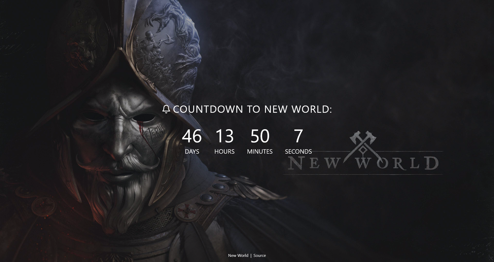
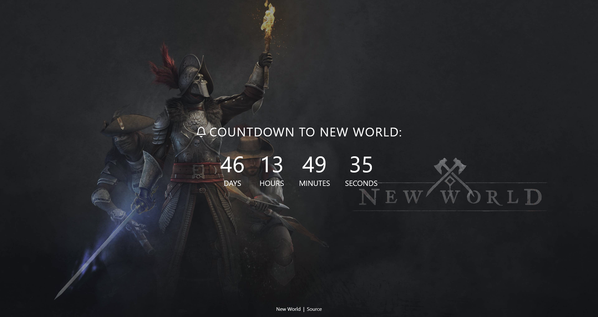

<h1 align="center">New World Countdown</h1>

[Deployed Site](https://newworldcountdown.com)

See the READMEs for each side of the stack to learn how to get it running yourself.

## Features

- Progressive Web App (PWA) - installable on mobile devices.
- Web Push Notifications (daily notifications upon subscribing via the bell icon)

## Tech Stack

- React frontend
- Node, Express, MongoDB backend
- Deployed on Netlify / Heroku / Mongo Atlas

## Screenshots

